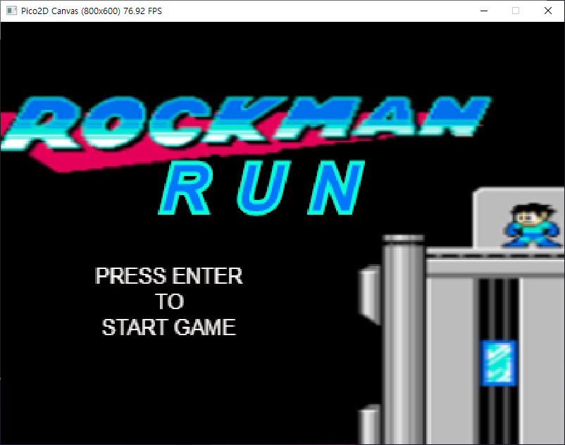
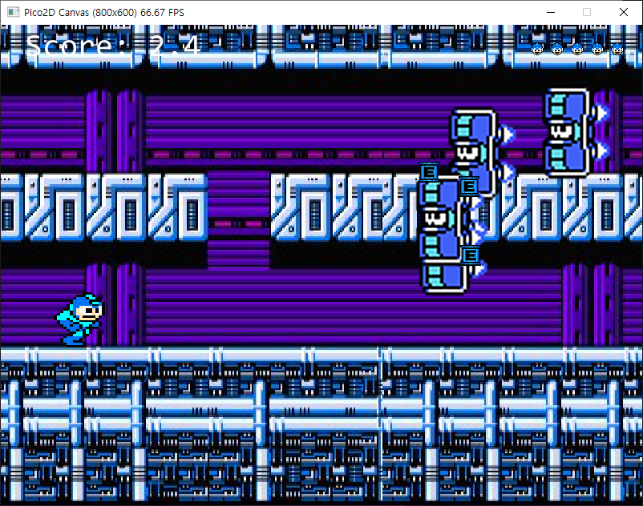
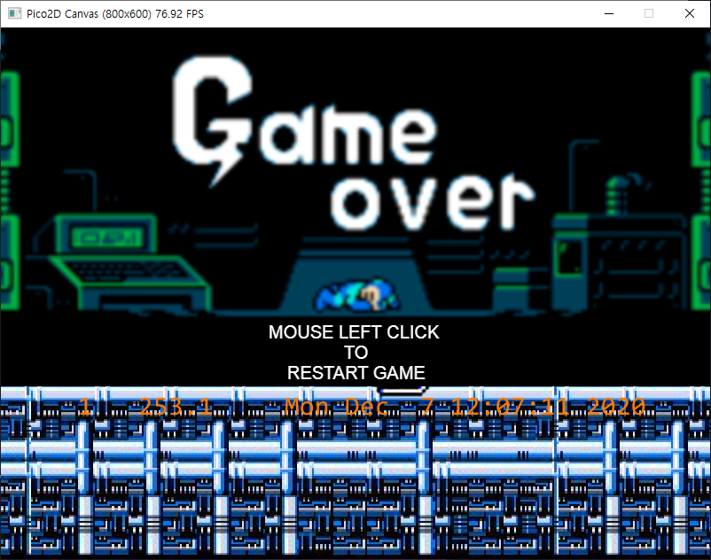
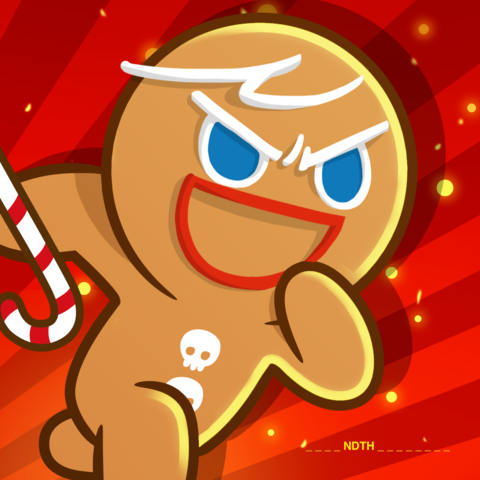
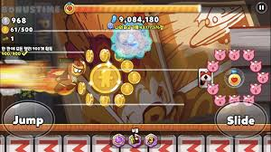

# 게임제목 : MEGAMAN RUN
* 기존 2D게임인 록맨의 이미지를 이용한 런게임.

* 최대한 오래살아남으며 점수를 올리는 방식으로 진행됨

***
## 게임의 소개
* 기본적인 런게임의 형식 + 기존의 2D게임 록맨의 이미지를 이용// 비슷한 런게임종류로 쿠키런이 있다.

***
## Scene 개수 : 4

* 기본적으로 Quit버튼으로 게임을 아무때나 종료가능
* 인트로씬 - 게임을 처음 켰을때 인트로를 넣을 예정 인트로는 한번만 불리고 본격적으로 시작한 후에는 다시 돌아오지않음 씬도중 ESC를 입력하면 다음씬으로 넘어감
* 게임메뉴씬 - 게임의 시작과 종료, 하이스코어씬으로 넘어갈 수 있는 버튼을 넣을 예정 키입력은 마우스를 이용해 메뉴를 선택
  * 메뉴버튼 선택 - 본게임씬으로 넘어감
  * 하이스코어 선택 - 하이스코어 씬으로 넘어감
  * 종료 선택 - 게임을 종료
* 게임씬 - 캐릭터가 달리기 시작하고 장애물들과 회복아이템, 적몬스터가 화면에서 캐릭터를 향해 이동
  * 캐릭터의 행동
    1. 점프 - 스페이스바를 입력 하면 점프, 수직으로 캐릭터를 점프시킨다.
    2. 공격 - x키를 입력하면 투사체를 발사하고 투사체가 적에 닿으면 적처치(충돌체크), 투사체는 최대 3개
  * ESC를 누르면 게임 일시정지 게임을 계속할것인지, 그만 할것인지를 선택 선택은 마우스를 이용할 예정
* 하이스코어씬 - 점수가 가장높은 10명의 하이스코어를 표시하고, 본게임에서 점수가 10위보다 높게 나온다면 점수를 저장함
  * R키를 입력 하면 다시 게임씬으로 돌아가서 새로 게임을 시작함
  * ESC를 입력하면 게임메뉴로 돌아감
***
 ## 필요할 것으로 예상되는 기술
  * 게임프레임워크에서 장면 전환
  * BGM과 효과음 넣기
  * 하이스코어를 파일로 저장하고 불러오기

  ## 게임의 개발범위
|내용|최소범위|추가구현|
|:---:|:---:|:---:|
|캐릭터컨트롤|기본적으로 제자리 달리기 Space bar키를 누르면 점프 , ENTER키를 누르면 공격||
|캐릭터의 기술|총쏘기  점프||
|적|메가맨을 향해 다가오는 움직임|메가맨을 향한 투사체공격|
|게임의 기능|	메가맨이 피격시 라이프감소,E캔획득과 적처치시 점수증가, 하이스코어달성시 저장, 게임의 일시정지와 재시작기능	|게임에 캐릭터를 추가하여 캐릭터 선택을 할수있도록 함|
|게임사운드효과|BGM 및 총쏘기, 적처치, 점프, E캔획득 효과음|	모으기 시 효과음추가|
|애니메이션|달리기, 점프 총쏘기 , 달리면서 총쏘기모션|	자연스럽게 애니메이션을 이어지게 하기|

캐릭터의 움직임 구현 성공
캐릭터의 기술 구현 성공
적 구현 성공 but 투사체 공격패턴 없음
캐릭터의 모으기 공격 삭제
캐릭터 추가 구현 실패
애니메이션 구현 성공

***
## 게임개발 일정
|주차|개발내용|상세|
|:---:|:---:|:---:|
|1~2주차|기본 캐릭터구현|1. 달리는 캐릭터 구현 2. 총쏘기 구현 3. 점프 구현|
|3주차|적 구현|	1. 캐릭터에 다가오는 적 AI구현 2. 적과 총알의 충돌체크 3. 충돌시 게임효과 작업|
|4주차|기본게임|캐릭터 체력과 점수	캐릭터의 체력과 점수를 표시|
|5~6주차|	추가구현과 점검|	추가구현 범위의 내용을 추가 구현, 게임을 좀더 자연스럽게 동작하도록 부족한 부분 보완, 가능하다면 인트로 부분에 영상처리, 하이스코어파일로 따로저장|
|7주차|	사운드작업|	게임의 효과음과 BGM넣기|
|8주차| 마무리|	게임의 오브젝트 최종설정 및 최종점검|

